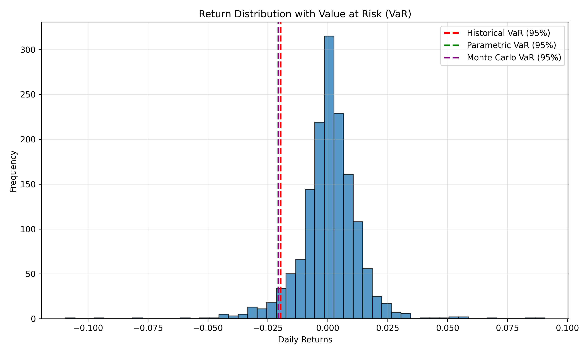

# Value at Risk (VaR) – Market Risk Model

This project implements and compares multiple Value at Risk (VaR) methodologies to estimate downside risk in financial markets.  
The analysis is performed on daily returns of the S&P 500 ETF (SPY).

The goal is to study tail risk under different modeling assumptions and highlight the strengths and limitations of each approach.

---

## Data
- Asset: SPY (S&P 500 ETF)
- Frequency: Daily
- Period: 2018–2024
- Prices are auto-adjusted for dividends and splits
- Returns are computed using simple daily percentage change

---

## Models Implemented

### 1. Historical VaR
- Uses the empirical distribution of observed returns
- Estimates risk as the lower 5th percentile of past returns
- Does not assume any parametric distribution

### 2. Parametric (Normal) VaR
- Assumes returns are normally distributed
- Risk is estimated using mean and standard deviation
- Fast to compute but sensitive to tail behavior

### 3. Monte Carlo VaR
- Simulates future returns using estimated distribution parameters
- VaR is computed from the simulated return distribution
- Flexible but dependent on model assumptions

---

## Visualization

The histogram below shows the empirical distribution of daily returns with VaR thresholds overlaid for each method.

---

## Key Observations
- Different VaR methods produce different risk estimates
- Parametric and Monte Carlo VaR are similar due to shared normality assumptions
- Historical VaR reflects realized tail behavior more directly
- All models underestimate extreme losses during periods of market stress

---

## Limitations
- VaR does not measure losses beyond the confidence threshold
- Normality assumptions break down during crises
- Tail dependence and regime changes are not explicitly modeled

---

## Potential Extensions
- Expected Shortfall (CVaR) to capture tail severity
- Portfolio VaR with multiple assets
- Non-normal return distributions (e.g., Student-t)
- Rolling VaR to study time-varying risk

---

## Tools
Python, NumPy, Pandas, SciPy, Matplotlib, yfinance
